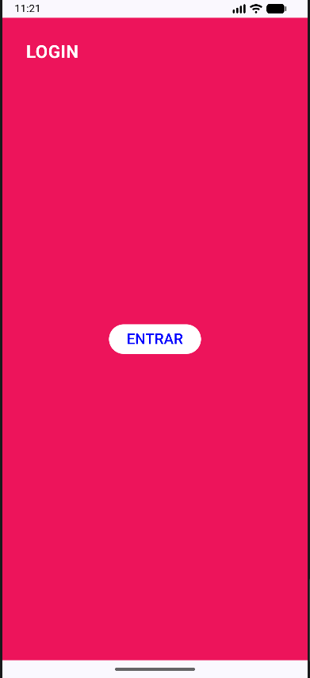
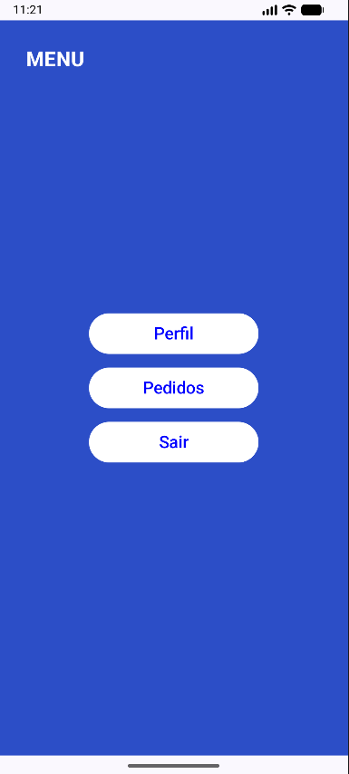
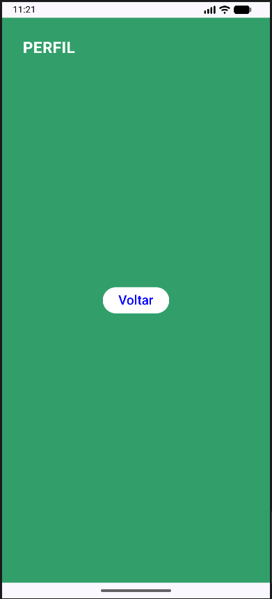
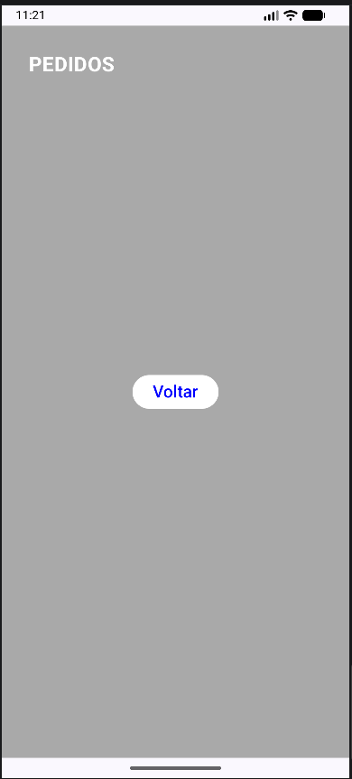

Esse é um projeto para aprender e esudar a navegação entre 
as principais telas e mais comuns nos aplicativos. Sendo elas a tela de loginn menu,
pedidos e perfil.
Interligando todas elas usando funcionalidades do Jetpack Compose